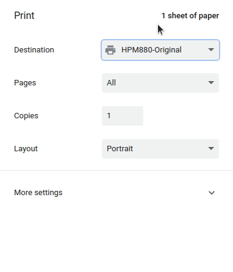
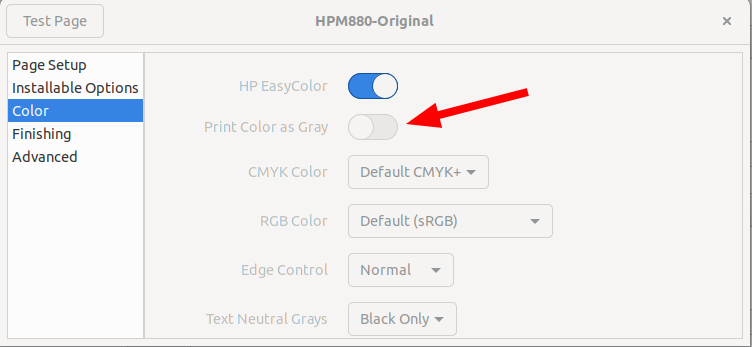
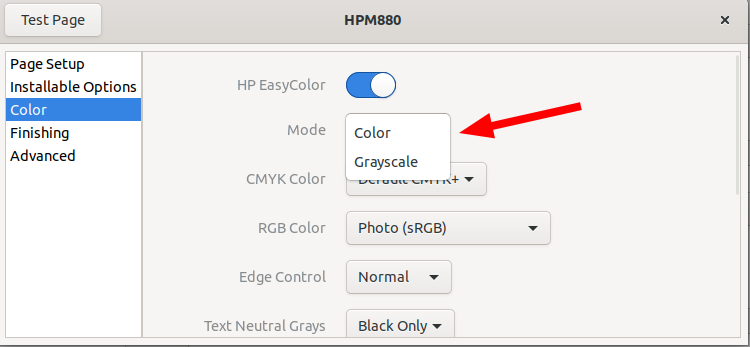

# HP-Color-LaserJet-flow-MFP-M880

Fixing color printing support in Chrome on Linux for HP M880, solves [Chrome Bug 1035009](https://bugs.chromium.org/p/chromium/issues/detail?id=1035009) for the [HP Color LaserJet flow MFP M880](https://support.hp.com/us-en/product/hp-color-laserjet-enterprise-flow-mfp-m880-series/5329035) printer. The effect of this printer driver is that the Chrome browser shows the Color/Black and White toggle in the print preview:

With the [original printer driver](https://developers.hp.com/hp-linux-imaging-and-printing) the Chrome browser (and potentially all Chromium based browsers) on Linux cannot print in color, only in grayscale. While one can use the system printing dialog as a workaround, it is inconvenient to do so and the system printing dialog doesn't show a preview of the printout as the browser printing dialog.

The root cause are hard coded strings in the [Chrome printing stack](https://github.com/chromium/chromium/blob/c4d3c31083a2e1481253ff2d24298a1dfe19c754/printing/backend/cups_helper.cc#L361) that match only for some HP printer drivers, while other HP printer drivers simply use other strings for the same thing. Chrome wants to offer the user a simplified configuration for printing, but for that Chrome needs to parse and understand all printer drivers. Sadly the printer drivers on Linux don't follow any standard in their internal structure, so that the Chrome developers had to add a lot of code to deal with the printer drivers of all the printer vendors.

The PPD file found here solves the problem because it simply uses the names for color and grayscale that Chrome already supports. As a result the printer configuration user interface also changes:

**Original Print Driver**

**Fixed Print Driver**

To install simply download [HP-M880-Chrome-Color-Print.ppd](HP-M880-Chrome-Color-Print.ppd) and use it as a custom PPD in the printer configuration.
